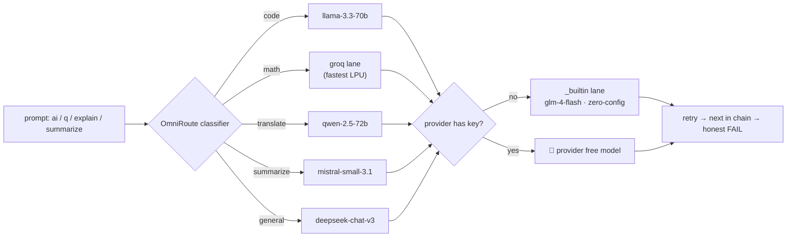

<div align="center">

# ⬛ QUANTA

### *The AI-Native Linux Terminal — in your browser*

**85 real commands · multi-provider AI routing · security toolkit · persistent virtual filesystem**

[](https://nextjs.org)
[](https://www.typescriptlang.org)
[](https://bun.sh)
[](#-testing)
[](https://github.com/qtjg/quanta-terminal/actions/workflows/ci.yml)
[](LICENSE)
[](#-contributing)


*Real round-trip LLM calls, real answers, honest telemetry — no mocks.*

</div>

---

## 📖 Table of Contents

- [What is QUANTA?](#-what-is-quanta)
- [Feature Matrix](#-feature-matrix)
- [Quick Start](#-quick-start)
- [The Command Catalog — 85 Commands](#-the-command-catalog--85-commands)
- [AI Engine & OmniRoute](#-ai-engine--omniroute)
- [Security Toolkit](#-security-toolkit)
- [Real Network](#-real-network)
- [Architecture](#-architecture)
- [Project Structure](#-project-structure)
- [Testing](#-testing)
- [Configuration](#-configuration)
- [Roadmap](#-roadmap)
- [Contributing](#-contributing)
- [License](#-license)

---

## 🧊 What is QUANTA?

QUANTA is a **fully functional Linux-style terminal that runs in the browser** — not a fake shell rendering canned outputs. Every command is really implemented against a persistent virtual filesystem (VFS), a real command engine with pipes, aliases, environment variables and man pages, and a live multi-provider AI gateway.

The root route **is** the terminal. One product, zero distraction.

```text
┌────────────────────────────────────────────────────────────────┐
│  QUANTA OS 0.5.0 — ai-native linux terminal                    │
│  kernel: quanta-vfs 1.0 · shell: quanta-sh · ai-engine: live   │
├────────────────────────────────────────────────────────────────┤
│  mayank@quanta:~$ ai What is 12*12? Just the number.           │
│  ┌ quanta-ai · 0.3s ────────────────────────────────────────┐  │
│  │ 144                                                      │  │
│  └──────────────────────────────────────────────────────────┘  │
│  mayank@quanta:~$ q now divide that by 4                       │
│  ┌ quanta-ai · 0.4s ────────────────────────────────────────┐  │
│  │ 36                                                       │  │
│  └──────────────────────────────────────────────────────────┘  │
└────────────────────────────────────────────────────────────────┘
```

## 🧩 Feature Matrix

| | Feature | Status |
|:---:|---|:---:|
| 🖥️ | **85 slash commands** — core, filesystem, text, sys, net, AI, security, fun | ✅ |
| 🧠 | **Live AI engine** — real LLM round-trips, multi-provider, pipes, audit trail | ✅ |
| 🛣️ | **OmniRoute** — task classification → best free model → automatic fallback chain | ✅ |
| 🔐 | **Security toolkit** — JWT audit, recon, hashing, ciphers, password entropy | ✅ |
| 💾 | **Persistent VFS** — files, history, theme survive full page reloads | ✅ |
| 🔌 | **Unix pipes** — `cat notes.txt \| grep TODO \| wc -l` actually works | ✅ |
| 🎨 | **5 themes** — carbon · matrix · amber · ocean · light | ✅ |
| 📱 | **Mobile ready** — touch keyboard support, responsive TTY layout | ✅ |
| ⚡ | **Lean stack** — 5 runtime deps, zero database required | ✅ |

## ⚡ Quick Start

```bash
# clone & install
git clone https://github.com/qtjg/quanta-terminal.git
cd quanta-terminal
bun install

# boot
bun run dev
```

Open **`http://localhost:3000`** and type:

```text
help                → the full 85-command index
neofetch            → system summary card
ai explain pipes    → AI explains unix pipes
omniroute on        → enable automatic model routing
recon example.com   → real DNS + RDAP + header audit
theme matrix        → there is no spoon
```

> **Zero-config AI:** with no API keys at all, the built-in gateway lane still works. Add any provider key (`.env`) and OmniRoute immediately unlocks that provider's free-model catalog.

## 📚 The Command Catalog — 85 Commands

<details open>
<summary><b>🧠 AI — 10 commands</b> (the headliner)</summary>

| Command | What it really does |
|---|---|
| `ai <prompt>` | Live LLM call — multi-provider, pipe-aware, continuation support, full audit trail |
| `q <natural language>` | Natural language → command translation → **executes it** |
| `explain <concept>` | AI explains a Linux/Unix concept in terminal context |
| `summarize <file>` | AI summarizes a file or piped input |
| `model [use <id>]` | Show or switch the active AI model |
| `models` | Free-model catalog across **all** providers |
| `providers` | Provider status, key presence, free tiers |
| `omniroute [on\|off\|status]` | Automatic best-model routing per task type |
| `route` | Active routing table: pick, fallback chain, retry policy |
| `bench <a> vs <b>` | Race two models head-to-head — real latency + verdict |

</details>

<details>
<summary><b>🖥️ Core — 19 commands</b></summary>

| Command | | Command | | Command | |
|---|---|---|---|---|---|
| `alias` | create/list aliases | `clear` | wipe screen | `date` | date & time |
| `echo` | print (expands $VAR) | `env` | environment | `exit` | lock terminal |
| `export` | set variable | `help` | command index | `history` | command history |
| `hostname` | machine name | `man` | manual pages | `motd` | message of the day |
| `sudo` | (honest sandbox 🙂) | `theme` | switch theme | `unalias` | drop alias |
| `uname` | system info | `uptime` | session load | `which` | locate command |
| `whoami` | current user | | | | |

</details>

<details>
<summary><b>💾 Filesystem — 24 commands</b> (persistent VFS)</summary>

`cat` · `cd` · `chmod` · `cp` · `df` · `du` · `find` · `head` · `ls` · `mkdir` · `mv` · `nl` · `pwd` · `rev` · `rm` · `rmdir` · `sort` · `stat` · `tail` · `touch` · `tree` · `uniq` · `wc` · `write`

Everything survives a full browser reload — the VFS is persisted client-side with automatic legacy-key migration.

</details>

<details>
<summary><b>✂️ Text — 12 commands</b></summary>

`ascii` · `base64` · `calc` (no eval) · `case` (11 transforms) · `diff` (LCS) · `grep` · `hash` (SHA-1/256/384/512) · `rand` · `regex` · `units` · `url` · `uuid`

</details>

<details>
<summary><b>⚙️ System — 7 commands</b></summary>

`free` · `kill` · `lscpu` · `neofetch` · `netstat` · `ps` · `top`

</details>

<details>
<summary><b>🌐 Network — 4 commands</b> (3 real + 1 honest sim)</summary>

| Command | Real? |
|---|---|
| `curl <url>` | ✅ REAL http request via server-side route (SSRF-guarded) |
| `ipinfo` | ✅ REAL egress-IP network/geo intelligence |
| `weather <city>` | ✅ REAL weather via wttr.in — no API key |
| `ping <host>` | ⚡ simulated RTT (browsers can't ICMP — it says so) |

</details>

<details>
<summary><b>🎮 Fun — 4 commands</b></summary>

`banner` · `cowsay` · `fortune` · `stopwatch`

</details>

## 🤖 AI Engine & OmniRoute

QUANTA's AI layer is provider-agnostic. Every prompt is **classified by task type**, then routed to the best available model — with a full fallback chain, retry policy and per-call telemetry.



**The provider stack:**

| Provider | Key env var | Free catalog |
|---|---|---|
| `builtin` | — *(none needed)* | `glm-4-flash` (auto) |
| `openrouter` | `OPENROUTER_API_KEY` | deepseek-chat-v3 · llama-3.3-70b · qwen-2.5-72b · gemma-3-27b · mistral-small-3.1 |
| `groq` | `GROQ_API_KEY` | always-free LPU tier — fastest inference |
| `gemini` | `GEMINI_API_KEY` | AI Studio free tier |
| `cerebras` | `CEREBRAS_API_KEY` | free wafer-scale tier |

Manual override always wins: `model use groq/llama-3.1-8b-instant` pins the lane and OmniRoute stands down.

## 🔐 Security Toolkit

Security commands — built for **learning and defense**, not offense:

<div align="center">


</div>

| Command | What you get |
|---|---|
| `jwt <token>` | Decode header/payload, audit claims — flags missing `exp`, stale `iat`, signature status |
| `recon <domain>` | **Real** DNS records + RDAP registration data + HTTP header security audit |
| `passwd <len>` | Cryptographically random passwords (`crypto.getRandomValues`) with live entropy meter |
| `hash <text>` | SHA-1/256/384/512 digests |
| `crackme` | Hash-cracking challenge game + **real dictionary-attack demo** (watch weak passwords die in milliseconds) |
| `cipher <algo> <text>` | rot13 / caesar / hex / binary toolbox |

## 🌐 Real Network

No fake latency theatre. `curl`, `ipinfo` and `weather` hit the real internet through a server-side proxy route with SSRF protection; `ping` is honestly labelled as simulated because browsers cannot send ICMP packets.

<div align="center">


</div>

## 🏗 Architecture


## 📂 Project Structure

```text
src/
├── app/
│   ├── page.tsx              # "/" IS the terminal (re-exports /terminal)
│   ├── terminal/             # ⬛ QUANTA — standalone chrome + metadata + icon
│   └── api/quanta/           # fetch · chat · models · recon · ai
├── components/quanta/        # command engine: core, cmd-*, fs, themes
└── lib/                      # omniroute router, providers, sec, rate-limit
scripts/                      # test suite + build helpers
docs/assets/                  # README media
```

## 🧪 Testing

No mocks. The suite drives the **real command engine** — including live-network segments and live LLM calls:

```bash
bun scripts/test-quanta.ts
```

```text
✓ 277 assertions across 85 commands — ALL GREEN
  ├─ core / fs / text / sys / fun      (engine + VFS persistence)
  ├─ ai / omniroute                    (live model round-trips, routing telemetry)
  ├─ sec / net                         (real DNS, RDAP, real fetches)
  └─ themes / legacy-key migration     (upgrade invariants)
```

CI-style gates: `bun run lint` (eslint, 0 errors) · `bunx tsc --noEmit` (0 errors).

## 🔧 Configuration

`.env` is **not committed** — the app runs fully with zero keys (builtin lane). Optional keys unlock provider lanes:

```bash
# .env  (optional — every line is optional)
OPENROUTER_API_KEY=sk-or-...         # biggest free catalog (:free models)
GROQ_API_KEY=gsk_...                 # fastest inference (LPU)
GEMINI_API_KEY=...                   # AI Studio free tier
CEREBRAS_API_KEY=...                 # wafer-scale free tier
NEXT_PUBLIC_SITE_URL=https://...     # canonical URL for robots/sitemap
```

## 🗺 Roadmap

- [ ] Push notifications for long-running AI jobs
- [ ] Mobile soft-keyboard UX polish
- [ ] Streaming AI output (token-by-token)
- [ ] Scriptable `.quanta` scripts (run command files)
- [ ] WebSocket collaborative sessions

## 🤝 Contributing

PRs are welcome! Keep the bar the repo already sets: **every new command ships with real assertions** in `scripts/test-quanta.ts`, honest failure output, and no mock data pretending to be live.

```bash
bun install
bun run dev                  # build
bun scripts/test-quanta.ts   # prove it
```

## 📄 License

[MIT](LICENSE) © 2026 MAYANK (qtjg)

---

<div align="center">

**⭐ Star the repo if QUANTA blipped your radar — it keeps the routers warm.**

*"real commands · real AI · real terminals don't fake it"*

</div>
