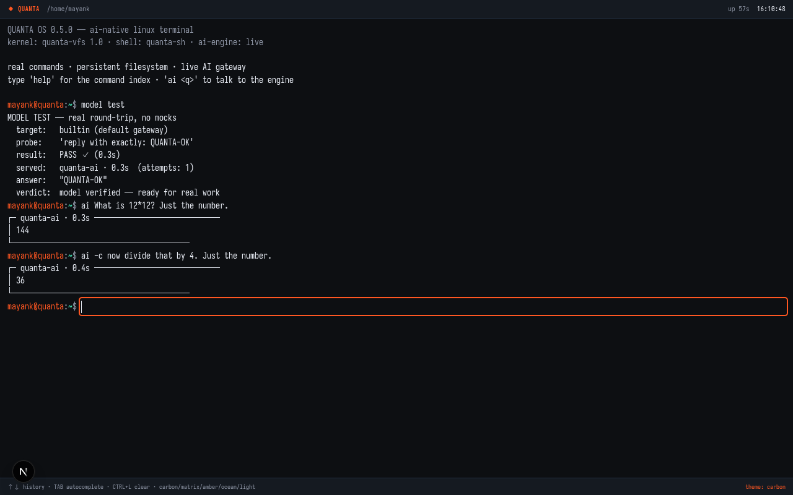
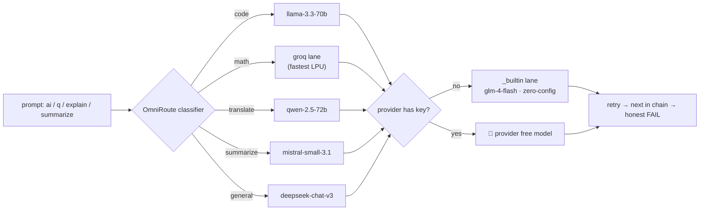
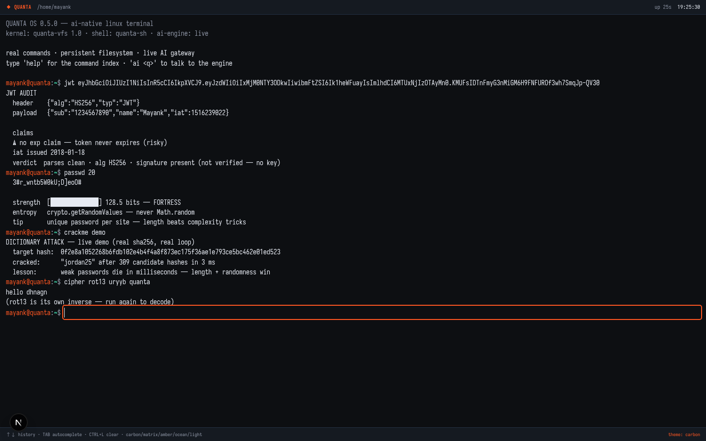
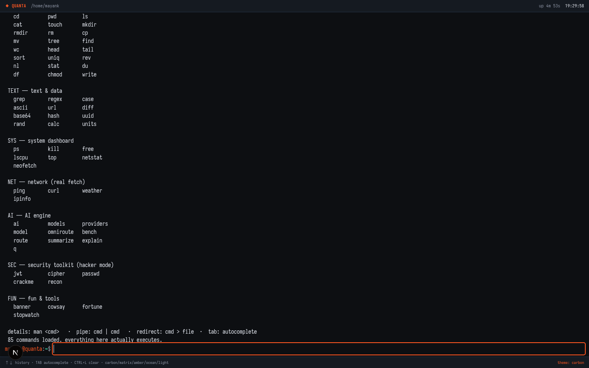
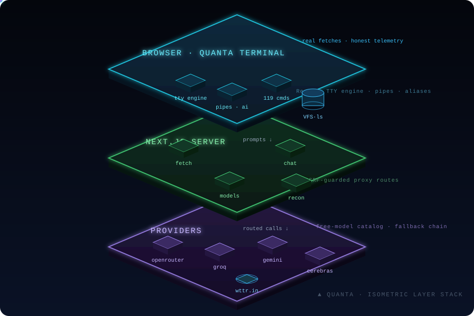
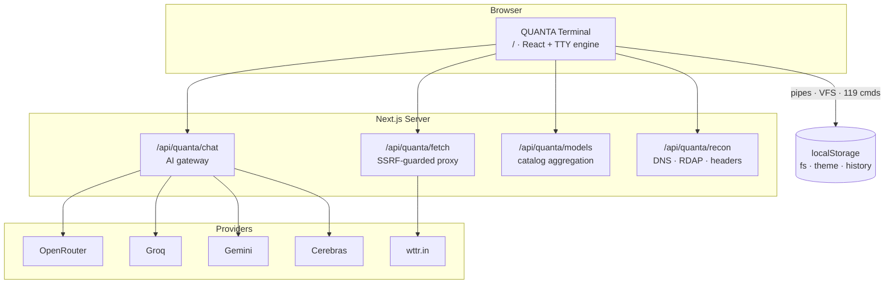

<div align="center">

# ⬛ QUANTA

<!-- ⬡ 3D-UPGRADE v1 by Mayank Bhaskar -->
<div align="center">



**made by [Mayank Bhaskar](https://github.com/qtjg)** ·  

### 🧊 3D View



*Floating isometric render — layers hover, data particles stream, shine sweeps.*

</div>

---
🩺 **New tool — `repo-pulse`**: instant git pulse (28-day heat bars, hot files, contributors). Run: `node tools/repo-pulse.mjs`

### *The AI-Native Linux Terminal — in your browser*

**119 real commands · multi-provider AI routing · security toolkit · developer tools · persistent virtual filesystem**

[](https://nextjs.org)
[](https://www.typescriptlang.org)
[](https://bun.sh)
[](#-testing)
[](https://github.com/qtjg/quanta-terminal/actions/workflows/ci.yml)
[](LICENSE)
[](#-contributing)



*▲ Isometric 3D render of the stack — floating terminal, glowing layers, live data beams. (animated)*



*Real round-trip LLM calls, real answers, honest telemetry — no mocks.*

</div>

---

## 📖 Table of Contents

- [What is QUANTA?](#-what-is-quanta)
- [Feature Matrix](#-feature-matrix)
- [Quick Start](#-quick-start)
- [The Command Catalog — 119 Commands](#-the-command-catalog--119-commands)
- [AI Engine & OmniRoute](#-ai-engine--omniroute)
- [Security Toolkit](#-security-toolkit)
- [Real Network](#-real-network)
- [Architecture](#-architecture)
- [Project Structure](#-project-structure)
- [Testing](#-testing)
- [Configuration](#-configuration)
- [Roadmap](#-roadmap)
- [Contributing](#-contributing)
- [License](#-license)

**Project docs:** [Architecture deep-dive](docs/ARCHITECTURE.md) · [Development guide](docs/DEVELOPMENT.md) · [AI routing](docs/AI-ROUTING.md) · [Keybindings](docs/KEYBINDINGS.md) · [FAQ](docs/FAQ.md) · [Roadmap](ROADMAP.md) · [Command reference](docs/COMMANDS.md)

---

## 🧊 What is QUANTA?

QUANTA is a **fully functional Linux-style terminal that runs in the browser** — not a fake shell rendering canned outputs. Every command is really implemented against a persistent virtual filesystem (VFS), a real command engine with pipes, aliases, environment variables and man pages, and a live multi-provider AI gateway.

The root route **is** the terminal. One product, zero distraction.

```text
┌────────────────────────────────────────────────────────────────┐
│  QUANTA OS 0.5.0 — ai-native linux terminal                    │
│  kernel: quanta-vfs 1.0 · shell: quanta-sh · ai-engine: live   │
├────────────────────────────────────────────────────────────────┤
│  mayank@quanta:~$ ai What is 12*12? Just the number.           │
│  ┌ quanta-ai · 0.3s ────────────────────────────────────────┐  │
│  │ 144                                                      │  │
│  └──────────────────────────────────────────────────────────┘  │
│  mayank@quanta:~$ q now divide that by 4                       │
│  ┌ quanta-ai · 0.4s ────────────────────────────────────────┐  │
│  │ 36                                                       │  │
│  └──────────────────────────────────────────────────────────┘  │
└────────────────────────────────────────────────────────────────┘
```

And here is the same machine as an **isometric 3D stack** — the terminal you touch on top, everything that makes it real underneath:

```text
              ╱▔▔▔▔▔▔▔▔▔▔▔▔▔▔▔╲
             ╱  ⬛ QUANTA TTY   ╲        ← the terminal you see
            ╱▁▁▁▁▁▁▁▁▁▁▁▁▁▁▁▁▁▁▁╲
               ╱▔▔▔▔▔▔▔▔▔▔▔▔▔╲
              ╱  ENGINE · 119  ╲       ← the command engine
             ╱▁▁▁▁▁▁▁▁▁▁▁▁▁▁▁▁▁▁╲
                ╱▔▔▔▔▔▔▔▔▔▔▔╲
               ╱  VFS · AI ⚡  ╲      ← storage + intelligence
              ╱▁▁▁▁▁▁▁▁▁▁▁▁▁▁▁▁╲
```

## 🧩 Feature Matrix

| | Feature | Status |
|:---:|---|:---:|
| 🖥️ | **119 slash commands** — core, filesystem, text, sys, net, AI, security, dev, fun | ✅ |
| 🧠 | **Live AI engine** — real LLM round-trips, multi-provider, pipes, audit trail | ✅ |
| 🛣️ | **OmniRoute** — task classification → best free model → automatic fallback chain | ✅ |
| 🔐 | **Security toolkit** — JWT audit, recon, hashing, ciphers, password entropy | ✅ |
| 💾 | **Persistent VFS** — files, history, theme survive full page reloads | ✅ |
| 🔌 | **Unix pipes** — `cat notes.txt \| grep TODO \| wc -l` actually works | ✅ |
| 🎨 | **5 themes** — carbon · matrix · amber · ocean · light | ✅ |
| 📱 | **Mobile ready + PWA** — installable app (Add to Home Screen), touch keyboard, responsive TTY layout | ✅ |
| 📜 | **Scripting** — `.qsh` command files: comments, `$VARS`, stop-on-error, nesting guard | ✅ |
| ⏮️ | **VFS time machine** — `snapshot` save/restore the whole filesystem (auto pre-restore safety) | ✅ |
| ⚡ | **Lean stack** — 5 runtime deps, zero database required | ✅ |

## ⚡ Quick Start

```bash
# clone & install
git clone https://github.com/qtjg/quanta-terminal.git
cd quanta-terminal
bun install

# boot
bun run dev
```

Open **`http://localhost:3000`** and type:

```text
help                → the full 119-command index
neofetch            → system summary card
ai explain pipes    → AI explains unix pipes
omniroute on        → enable automatic model routing
recon example.com   → real DNS + RDAP + header audit
theme matrix        → there is no spoon
```

> **Zero-config AI:** with no API keys at all, the built-in gateway lane still works. Add any provider key (`.env`) and OmniRoute immediately unlocks that provider's free-model catalog.

## 📚 The Command Catalog — 119 Commands

<details open>
<summary><b>🧠 AI — 11 commands</b> (the headliner)</summary>

| Command | What it really does |
|---|---|
| `ai <prompt>` | Live LLM call — multi-provider, pipe-aware, continuation support, full audit trail |
| `q <natural language>` | Natural language → command translation → **executes it** |
| `explain <concept>` | AI explains a Linux/Unix concept in terminal context |
| `summarize <file>` | AI summarizes a file or piped input |
| `translate <lang>` | AI translation into any language — pipe-aware (`cat file \| translate de`) |
| `model [use <id>]` | Show or switch the active AI model |
| `models` | Free-model catalog across **all** providers |
| `providers` | Provider status, key presence, free tiers |
| `omniroute [on\|off\|status]` | Automatic best-model routing per task type |
| `route` | Active routing table: pick, fallback chain, retry policy |
| `bench <a> vs <b>` | Race two models head-to-head — real latency + verdict |

</details>

<details open>
<summary><b>🖥️ Core — 20 commands</b></summary>

| Command | | Command | | Command | |
|---|---|---|---|---|---|
| `alias` | list or create aliases | `clear` | clear the terminal screen | `date` | current date & time |
| `echo` | print text (expands $VAR) | `env` | print environment variables | `exit` | lock the terminal (reload to boot again) |
| `export` | set an environment variable | `help` | show the full command index | `history` | show command history |
| `hostname` | print machine hostname | `man` | manual page for a command | `motd` | message of the day |
| `sudo` | elevated run (honestly: same sandbox) | `theme` | list or switch terminal theme | `unalias` | remove an alias |
| `uname` | system information | `uptime` | session uptime + load | `which` | locate a command |
| `whoami` | print current user | `script` | .qsh scripting — run command files |  |  |

</details>

<details>
<summary><b>📁 Filesystem — 30 commands</b></summary>

| Command | | Command | | Command | |
|---|---|---|---|---|---|
| `basename` | strip directory from path | `cat` | print file contents | `cd` | change directory |
| `chmod` | change file mode (tracked in VFS) | `cp` | copy file | `df` | filesystem usage (sandbox volume) |
| `dirname` | strip last component from path | `du` | disk usage of a path | `find` | find files by name (-name substring) |
| `fsck` | VFS integrity check — walks every node | `head` | first N lines (file or pipe) | `ls` | list directory contents |
| `mkdir` | create directory (-p for parents) | `mv` | move / rename file | `nl` | number all lines (file or pipe) |
| `pwd` | print working directory | `realpath` | canonical absolute path (resolves . .. ~) | `rev` | reverse each line's characters (file or pipe) |
| `rm` | remove file or directory (-r recursive, -f force) | `rmdir` | remove an empty directory | `sort` | sort lines (file or pipe) |
| `split` | split a file into N-line chunks (xaa, xab, …) | `stat` | file metadata | `tail` | last N lines (file or pipe) |
| `touch` | create an empty file / bump mtime | `tree` | recursive directory tree | `uniq` | drop consecutive duplicate lines (file or pipe) |
| `wc` | count lines/words/chars (file or pipe) | `write` | write text into a file (VFS) | `snapshot` | filesystem time machine — save/restore |

</details>

<details open>
<summary><b>✂️ Text & Data — 24 commands</b></summary>

| Command | | Command | | Command | |
|---|---|---|---|---|---|
| `ascii` | ascii/unicode code table | `base64` | base64 encode/decode | `calc` | safe calculator (no eval) |
| `case` | 11 case transforms | `diff` | line diff of two files (LCS) | `expand` | expand tabs to spaces (tab stops) |
| `factor` | prime factorization of an integer | `fold` | wrap each line at width | `grep` | search text (file, pipe or inline) |
| `hash` | sha-1/256/384/512 of text | `json` | JSON toolkit — validate, pretty, keys, get, type | `lorem` | lorem ipsum filler text generator |
| `pad` | align text left/right/center to width | `rand` | random int / pick from list | `regex` | regex tester: matches + groups |
| `seq` | print a number sequence | `shuf` | shuffle lines (file, pipe or list) | `slug` | slugify text → URL-safe identifier |
| `strdist` | Levenshtein edit distance + similarity | `units` | unit conversion | `url` | url parser + enc/dec |
| `uuid` | generate uuid v4 | `wordfreq` | word frequency table (-s skips stop words) | `yes` | repeat a string n times (bounded) |

</details>

<details>
<summary><b>⚙️ System — 9 commands</b></summary>

| Command | | Command | | Command | |
|---|---|---|---|---|---|
| `cal` | calendar for a month (current or given) | `free` | memory overview | `kill` | signal a process by pid |
| `lscpu` | cpu info of this device | `neofetch` | system summary card | `netstat` | sandbox connection table |
| `ps` | process snapshot (quanta services) | `top` | one-shot system dashboard | `tz` | current time across timezones (real Intl) |

</details>

<details>
<summary><b>🌐 Network (real) — 6 commands</b></summary>

| Command | | Command | | Command | |
|---|---|---|---|---|---|
| `curl` | REAL http request via quanta backend | `headers` | REAL HTTP response headers for a URL | `ipinfo` | REAL network/geo info of this server's egress IP |
| `isup` | REAL site availability check (status + latency) | `ping` | latency probe (simulated RTT) | `weather` | REAL weather via wttr.in (no key) |

</details>

<details>
<summary><b>🎉 Fun & Tools — 7 commands</b></summary>

| Command | | Command | | Command | |
|---|---|---|---|---|---|
| `8ball` | the magic 8-ball answers | `banner` | big block-letter banner | `cowsay` | the cow says it |
| `dice` | roll NdM dice — total + individual rolls | `fortune` | random dev wisdom | `matrix` | a frozen frame of digital rain |
| `stopwatch` | live stopwatch |  |  |  |  |

</details>

<details>
<summary><b>🔐 Security Toolkit — 6 commands</b></summary>

| Command | | Command | | Command | |
|---|---|---|---|---|---|
| `cipher` | classic cipher toolbox (rot13/caesar/hex/bin) | `crackme` | hash cracking: challenge game + real dictionary attack | `entropy` | Shannon entropy analysis of text/passwords |
| `jwt` | decode & audit a JSON web token | `passwd` | strong password generator with entropy meter | `recon` | REAL domain recon: DNS + RDAP whois + HTTP header audit |

</details>

<details>
<summary><b>🛠️ Dev Tools — 6 commands</b></summary>

| Command | | Command | | Command | |
|---|---|---|---|---|---|
| `pw` | crypto-grade password generator (ambiguous chars excluded) | `base` | convert bin/oct/dec/hex (`base 10:16 255`) | `ts` | epoch ↔ date, both directions |
| `color` | hex ↔ rgb ↔ hsl + WCAG contrast grading | `csv` | RFC-4180 parser → table or JSON (quoted fields) | `cron` | cron expression explainer + next real run times |

</details>

## 🤖 AI Engine & OmniRoute

QUANTA's AI layer is provider-agnostic. Every prompt is **classified by task type**, then routed to the best available model — with a full fallback chain, retry policy and per-call telemetry.



**The provider stack:**

| Provider | Key env var | Free catalog |
|---|---|---|
| `builtin` | — *(none needed)* | `glm-4-flash` (auto) |
| `openrouter` | `OPENROUTER_API_KEY` | deepseek-chat-v3 · llama-3.3-70b · qwen-2.5-72b · gemma-3-27b · mistral-small-3.1 |
| `groq` | `GROQ_API_KEY` | always-free LPU tier — fastest inference |
| `gemini` | `GEMINI_API_KEY` | AI Studio free tier |
| `cerebras` | `CEREBRAS_API_KEY` | free wafer-scale tier |

Manual override always wins: `model use groq/llama-3.1-8b-instant` pins the lane and OmniRoute stands down.

## 🔐 Security Toolkit

Security commands — built for **learning and defense**, not offense:

<div align="center">



</div>

| Command | What you get |
|---|---|
| `jwt <token>` | Decode header/payload, audit claims — flags missing `exp`, stale `iat`, signature status |
| `recon <domain>` | **Real** DNS records + RDAP registration data + HTTP header security audit |
| `passwd <len>` | Cryptographically random passwords (`crypto.getRandomValues`) with live entropy meter |
| `hash <text>` | SHA-1/256/384/512 digests |
| `crackme` | Hash-cracking challenge game + **real dictionary-attack demo** (watch weak passwords die in milliseconds) |
| `cipher <algo> <text>` | rot13 / caesar / hex / binary toolbox |

## 🌐 Real Network

No fake latency theatre. `curl`, `ipinfo` and `weather` hit the real internet through a server-side proxy route with SSRF protection; `ping` is honestly labelled as simulated because browsers cannot send ICMP packets.

<div align="center">



</div>

## 🏗 Architecture

<div align="center">



*▲ The stack in isometric 3D — requests fall through the layers like light through glass. (animated)*

</div>

**Data-flow detail:**



## 📂 Project Structure

```text
src/
├── app/
│   ├── page.tsx              # "/" IS the terminal (re-exports /terminal)
│   ├── terminal/             # ⬛ QUANTA — standalone chrome + metadata + icon
│   └── api/quanta/           # fetch · chat · models · recon · ai
├── components/quanta/        # command engine: core, cmd-*, fs, themes
└── lib/                      # omniroute router, providers, sec, rate-limit
scripts/                      # test suite + build helpers
docs/assets/                  # README media
```

## 🧪 Testing

No mocks. The suite drives the **real command engine** — including live-network segments and live LLM calls:

```bash
bun scripts/test-quanta.ts
```

```text
✓ 391 assertions across 119 commands — ALL GREEN
  ├─ core / fs / text / sys / fun      (engine + VFS persistence)
  ├─ ai / omniroute                    (live model round-trips, routing telemetry)
  ├─ sec / net                         (real DNS, RDAP, real fetches)
  └─ themes / legacy-key migration     (upgrade invariants)
```

CI-style gates: `bun run lint` (eslint, 0 errors) · `bunx tsc --noEmit` (0 errors).

## 🔧 Configuration

`.env` is **not committed** — the app runs fully with zero keys (builtin lane). Optional keys unlock provider lanes:

```bash
# .env  (optional — every line is optional)
OPENROUTER_API_KEY=sk-or-...         # biggest free catalog (:free models)
GROQ_API_KEY=gsk_...                 # fastest inference (LPU)
GEMINI_API_KEY=...                   # AI Studio free tier
CEREBRAS_API_KEY=...                 # wafer-scale free tier
NEXT_PUBLIC_SITE_URL=https://...     # canonical URL for robots/sitemap
```

## 🗺 Roadmap

Tracked on the [issue tracker](https://github.com/qtjg/quanta-terminal/issues) — grab one and read the acceptance criteria:

- [ ] Streaming AI output (token-by-token) — [#1](https://github.com/qtjg/quanta-terminal/issues/1)
- [ ] Push notifications for long-running AI jobs — [#2](https://github.com/qtjg/quanta-terminal/issues/2)
- [ ] Mobile soft-keyboard UX polish — [#3](https://github.com/qtjg/quanta-terminal/issues/3)
- [ ] WebSocket collaborative sessions — [#4](https://github.com/qtjg/quanta-terminal/issues/4)
- [x] ~~Scriptable `.quanta` scripts (run command files)~~ — shipped v0.7.0 as `script` (.qsh files, stop-on-error, -k keep-going)
- [x] ~~Dev tools category: `pw`, `base`, `ts`, `color`, `csv`, `cron`~~ — shipped in v0.6.0

Also accepting: [VFS snapshot export/import](https://github.com/qtjg/quanta-terminal/issues/5) · [history autosuggestions](https://github.com/qtjg/quanta-terminal/issues/6) · [AI pipe support](https://github.com/qtjg/quanta-terminal/issues/7) · [PWA offline hardening](https://github.com/qtjg/quanta-terminal/issues/8) · [visual regression suite](https://github.com/qtjg/quanta-terminal/issues/9) · [session persistence](https://github.com/qtjg/quanta-terminal/issues/10)

## 🤝 Contributing

PRs are welcome! Keep the bar the repo already sets: **every new command ships with real assertions** in `scripts/test-quanta.ts`, honest failure output, and no mock data pretending to be live.

```bash
bun install
bun run dev                  # build
bun scripts/test-quanta.ts   # prove it
```

## 📄 License

[MIT](LICENSE) © 2026 MAYANK (qtjg)

---

<div align="center">

**⭐ Star the repo if QUANTA blipped your radar — it keeps the routers warm.**

*"real commands · real AI · real terminals don't fake it"*

</div>
